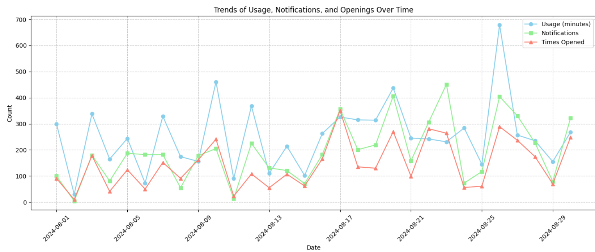
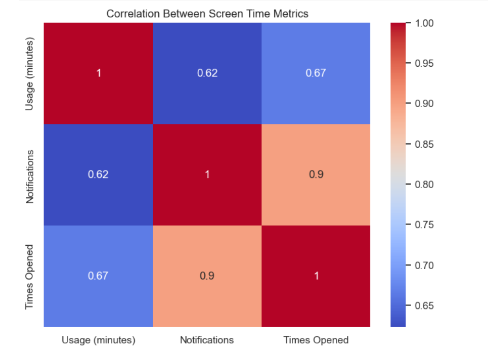

# Screen Time Analysis and Visualization 📊  

## 📖 Project Overview  
This project explores and visualizes screen time usage data, highlighting app usage, notifications, and app openings over time. The goal is to extract insights and trends through data analysis and visualization.  

## 🚀 Features  
- 📈 Time-series Analysis of Screen Time  
- 🔥 Correlation Analysis Between Metrics  
- 🛠️ Distribution and Trend Plots  
- 🎨 Visualizations using Matplotlib and Seaborn  

## 📂 Project Structure  
- **screentime_analysis.ipynb** – Jupyter Notebook with the complete analysis.  
- **screentime_analysis.py** – Python script version.  
- **screentime_analysis.csv** – The dataset used for analysis.  
- **images/** – Visuals generated from the project.  
- **requirements.txt** – List of dependencies.  

## 📊 Visualizations  
Here are a few visualizations from the project:  

  
*Trends of Usage, Notifications, and Times Opened Over Time*  

  
*Correlation Between Screen Time Metrics*  

## 📁 Dataset  
The dataset `screentime_analysis.csv` contains daily app usage, notifications, and app openings. You can replace this with your own dataset for personalized analysis.  

## 🛠️ Requirements  
Install the necessary dependencies using the following command:  
```bash
pip install -r requirements.txt
